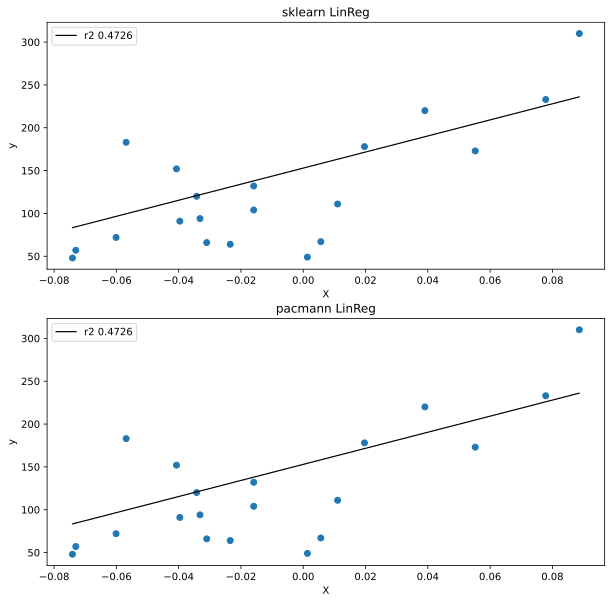

## Pacmann's Linear Regression Module

This repository is created for showcasing the result of Pacmann.AI's assignment on "Creating a fully functional Python module from scratch" in which the Linear Regression module is chosen. 

### Table of Contents

1. [Description](#description)
2. [Requirements](#requirements)
3. [Usage](#usage)
4. [Files](#files)
5. [Licensing and Acknowledgements](#licensing)

### Description

The python module `pacmann` contains a class named `PacLinearRegression`. This class possesses many attributes,

```
    Attributes
    ----------
    learning_rate : float
        learning rate of the linear regression for gradient descent
    cost_function : str
        type of cost function to be used (mae or mse)
    max_iter : int
        number of gradient descent iteration (10x higher for mae)
    X : array of float/int
        the feature array of the dataset
    y : array of float/int
        the label array of the dataset
    theta0 : arrray of float
        slope parameter(s) of linear regression
    theta1 : float
        intercept/bias parameter of linear regression
    m : int
        number of data points
    cost_hist: list of float
        the historical cost function values
    coeff_: list of float
        the list representation of theta0 and theta1, respectively
```

These attributes are accompanied by the following methods.

```
    Methods
    -------
    fit(X, y):
        Fit a linear regression to a data by calling gradientDescent method.
    computeCostFunction(y_pred):
        Return cost value per specified cost function.
    gradientCalculation(y_pred):
        Calculate gradients for theta0 and theta1 provided the type of cost
        function.
    gradientDescent():
        Create a loop of gradient descent method, appending cost_hist per iter.
    predict(X):
        Predict the label given feature X.
    score(y_val, y_pred):
        Return the R-squared metric of the model.
```

Each of the methods are documented using docstrings as necessary along with a notebook that contains an example of how to construct the PacLinearRegression class with one or many independent variables. A figure of comparison between PacLinearRegression's and LinearRegression's (sklearn) performance is shown below. 



### Requirements<a name="requirements"></a>

The following requirements shown are the modules needed in order to use the `pacmann` class (refers to `pacmann.py`).

```
numpy
sys
collections
```

### Usage<a name="usage"></a>

The following import statement can be used while having `pacmann.py` script on the same directory:

```
from pacmann import PacLinearRegression

# given dataset with X as feature and y as label

pac_linreg = PacLinearRegression() # set the attributes accordingly 
pac_linreg.fit(X, y)

# given dataset with X_test as feature test

y_pred = pac_linreg.predict(X_test)
```

For a more thorough example, check `class_demo.ipynb`.

A possible improvement step in the future is to submit the module on `pypi` so that potential users can seamlessly carry out `pip install pacmann`. This allows them to call the `import` statement without having to specifically place the physical `pacmann.py` script.

### Files<a name="files"></a>

The files in this repository are organized as follows. 

```
- figures
| - sample_linear_reg_sklearn_vs_pacmann.svg

- class_demo.ipynb
- pacmann.py
- README.md
```

### Licensing and Acknowledgements<a name="licensing"></a>

Credit to Pacmann.AI for the idea to implement the Linear Regression model from scratch. The performance's benchmark, in terms of R squared score and coefficient values, is based [sklearn LinearRegression model](https://scikit-learn.org/stable/modules/generated/sklearn.linear_model.LinearRegression.html).